  <h1>Hi, I'm Gustavo 👋</h1>
  

    
    
    
  

## Sobre mim

- 🎓 Estudante de desenvolvimento de software
- 💻 Foco em **TypeScript**, **React** e **.NET**
- 🚀 Trabalhando em [imoveis-patricia](https://github.com/gutakeuchi/imoveis-patricia)
- 📍 São Paulo, Brasil

## Tecnologias

  

## Estatísticas

  
  

## Projetos

**[imoveis-patricia](https://github.com/gutakeuchi/imoveis-patricia)**  
App de imóveis com React, TypeScript, Vite e Supabase

**[SuperHeroAPI-DotNet8](https://github.com/gutakeuchi/SuperHeroAPI-DotNet8)**  
API em .NET 8

**[social-media](https://github.com/gutakeuchi/social-media)**  
Rede social no estilo Twitter

**[todolist-nextjs](https://github.com/gutakeuchi/todolist-nextjs)**  
To-do list com Next.js, Node.js e MySQL

**[site-urban-art](https://github.com/gutakeuchi/site-urban-art)**  
Site em HTML5, CSS3 e Bootstrap

---

Obrigado por visitar o perfil!

